# Web Framework

## 1. Project description

This project evolves a sequential, socket-based HTTP server into a small,
maintainable **application server (lightweight web framework)**, inspired by
frameworks like Spark or Express. Instead of hardcoding routes with
`if/else` inside the server's connection loop, application developers
register HTTP GET endpoints as **Java lambda functions**, and static
resources (HTML, CSS, JS, images) are served through a separate,
configurable static-file service.

The framework exposes a small public API:

```java
staticfiles("/webroot");

get("/hello", (req, resp) -> "Hello " + req.getValue("name"));

start();
```

The server remains **strictly sequential** — one TCP connection is handled
at a time. No threads, thread pools, or concurrent request handling were
added in this lab. The application supports externalized configuration via
environment variables, and a graceful, development-only shutdown mechanism.
The complete application is deployed on a single AWS EC2 instance.

---

## 2. Architecture

Application (Application.java)
Registers routes and reads environment configuration
│
▼
Framework API (WebFramework.java)
Exposes get(), staticfiles(), start(), stop()
│
▼
Router (Router.java)
Maps a request path to a registered lambda handler
│
▼
HTTP Server (HttpServer.java)
Accepts one connection at a time, parses the request line,
reads query parameters, and dispatches:
1) to a matching dynamic route, or
2) to the Static File Service as a fallback, or
3) returns 404 if neither matches
   │
   ├──────────────┐
   ▼              ▼
   Request / Response Static File Service
   (data abstractions) (StaticFileService.java)
   Serves HTML/CSS/JS/images
   as bytes from a configurable
   base directory, rejecting
   path traversal attempts.


**Request flow:**

Incoming request
↓
Parse HTTP method, path, and query string
↓
Look for a registered dynamic route (Router)
↓
If found → execute its lambda handler → return its result
↓
If not found → attempt to serve a static resource
↓
If neither exists → return 404 Not Found


### Responsibilities of the main components

| Component | Responsibility |
|---|---|
| `Application` | Registers the application's own routes and reads environment-specific configuration (`PORT`, `APP_ENV`, `GREETING_PREFIX`, `STATIC_FILES_PATH`). |
| `WebFramework` | Public static facade (`get`, `staticfiles`, `start`, `stop`); the only class application code interacts with. |
| `Router` | Stores registered routes and resolves a request path to its `Route`, decoupling route registration from the connection loop. |
| `Route` | Pairs a path with its lambda `Service`. |
| `Service` | Functional interface representing a lambda handler: `(Request, Response) -> String`. |
| `Request` | Exposes the resolved path and query-string values (`getValue(name)`), hiding raw socket/stream details from application code. |
| `Response` | Represents the outgoing response (currently content type); extensible for future response metadata. |
| `HttpServer` | Accepts one TCP connection at a time, parses the request line, drains headers, dispatches to `Router` or `StaticFileService`, and implements graceful shutdown. |
| `StaticFileService` | Resolves a request path against a configurable base directory, reads files as bytes, assigns content types, and rejects path traversal. |

---

## 3. Architecture metaphor: the office building

| Building metaphor | Framework component |
|---|---|
| Building entrance and receptionist | `HttpServer`: receives every visitor (connection), reads what they're asking for, and decides where to send them — one visitor at a time, never two at once. |
| Directory in the lobby | `Router`: looks up which office handles a given request. |
| Individual offices | Lambda handlers (`get("/hello", ...)`, `get("/pi", ...)`): each office does one specific job and hands back a result. |
| Document archive | `StaticFileService`: a filing room that hands out existing documents (HTML, CSS, JS, images) exactly as they are stored, without any office having to process them. |
| Building configuration board | Environment variables (`PORT`, `APP_ENV`, `GREETING_PREFIX`, `STATIC_FILES_PATH`): settings posted at the entrance that change how the building operates, without needing to rebuild it. |
| Closing procedure | Graceful shutdown (`/shutdown` in development only): the receptionist finishes serving the visitor currently at the counter, locks the front door so no one else can enter, and only then turns off the lights — never leaving a visitor mid-conversation. |

---

## 4. Prerequisites

- Java 17 (JDK) or higher
- Maven 3.8+
- A web browser

---

## 5. Build and run locally

Clone and build:

```bash
git clone https://github.com/sbarros21/TDSE-Building-and-Deploying-a-Maintainable-Application-Server.git
cd TDSE-Building-and-Deploying-a-Maintainable-Application-Server
mvn clean package
```

Run with defaults (port 8080, development mode):

```bash
mvn exec:java
```

Or run the packaged JAR directly:

```bash
java -jar target/webframework-lab3-jar-with-dependencies.jar
```

Open in the browser:

http://localhost:8080


**Shutdown (development only):** visiting `http://localhost:8080/shutdown`
stops the server gracefully after responding.

---

## 6. Environment variables

| Variable | Purpose | Local default |
|---|---|---|
| `PORT` | HTTP server port | `8080` |
| `GREETING_PREFIX` | Prefix used by the `/hello` route | `Hello` |
| `APP_ENV` | Execution environment; `development` registers `/shutdown`, any other value (e.g. `production`) disables it | `development` |
| `STATIC_FILES_PATH` | Location of static resources | `/webroot` (bundled in the jar) |

Example (PowerShell):

```powershell
$env:GREETING_PREFIX="Hola"; $env:PORT="9090"; mvn exec:java
```

Example (bash):

```bash
GREETING_PREFIX=Hola PORT=9090 mvn exec:java
```

No credentials, tokens, or secrets are configured through environment
variables in this project.

---

## 7. Cloud deployment

**Platform used:** AWS EC2 (Amazon Linux), provisioned through
**AWS Academy Learner Lab**, region `us-east-1`.

**Public deployment URL:**

http://13.220.188.102:8080


> Note: this is a temporary AWS Academy Learner Lab instance and may be
> terminated after the lab session ends.

### Reproducing the deployment

1. Launch an EC2 instance (Amazon Linux, `t3.micro`, default Learner Lab key
   pair).
2. Configure a Security Group allowing:
    - SSH (22) restricted to known IP ranges.
    - Custom TCP on port 8080, open for testing.
3. Connect via EC2 Instance Connect.
4. Install dependencies:
```bash
   sudo dnf install -y java-17-amazon-corretto maven git
```
5. Clone and build:
```bash
   git clone https://github.com/sbarros21/TDSE-Building-and-Deploying-a-Maintainable-Application-Server.git
   cd TDSE-Building-and-Deploying-a-Maintainable-Application-Server
   mvn clean package
   mkdir -p ~/deploy
   cp target/webframework-lab3-jar-with-dependencies.jar ~/deploy/
   cp -r src/main/resources/webroot ~/deploy/webroot
```
6. Configure and start a `systemd` service (`webframework.service`) with:
```ini
   Environment=PORT=8080
   Environment=APP_ENV=production
   Environment=GREETING_PREFIX=Hello
   Environment=STATIC_FILES_PATH=webroot
   ExecStart=/usr/bin/java -jar /home/ec2-user/deploy/webframework-lab3-jar-with-dependencies.jar
```
7. `sudo systemctl daemon-reload && sudo systemctl enable --now webframework.service`

Setting `APP_ENV=production` in the service file ensures the `/shutdown`
route is never registered in the cloud deployment.

### Example URLs

| Resource | URL |
|---|---|
| Home page (static HTML) | `http://13.220.188.102:8080/index.html` |
| Static CSS | `http://13.220.188.102:8080/styles.css` |
| Static JS | `http://13.220.188.102:8080/app.js` |
| Static image | `http://13.220.188.102:8080/images/logo.png` |
| Greeting service (lambda) | `http://13.220.188.102:8080/hello?name=Pedro` |
| Pi service (lambda) | `http://13.220.188.102:8080/pi` |
| Unknown resource | `http://13.220.188.102:8080/unknown` → `404` |
| Shutdown (must be disabled) | `http://13.220.188.102:8080/shutdown` → `404` in production |

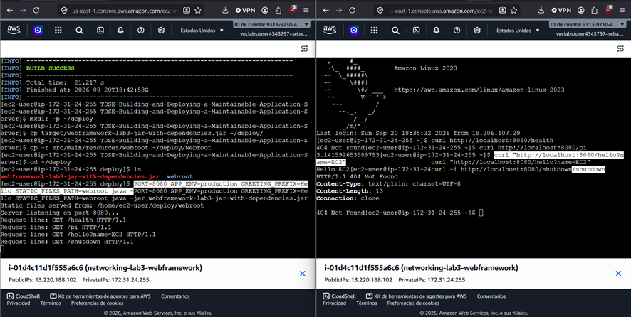

---

## 8. Evidence

All screenshots referenced are stored in `docs/evidence/`.

- **Deployed page loading:** 
- 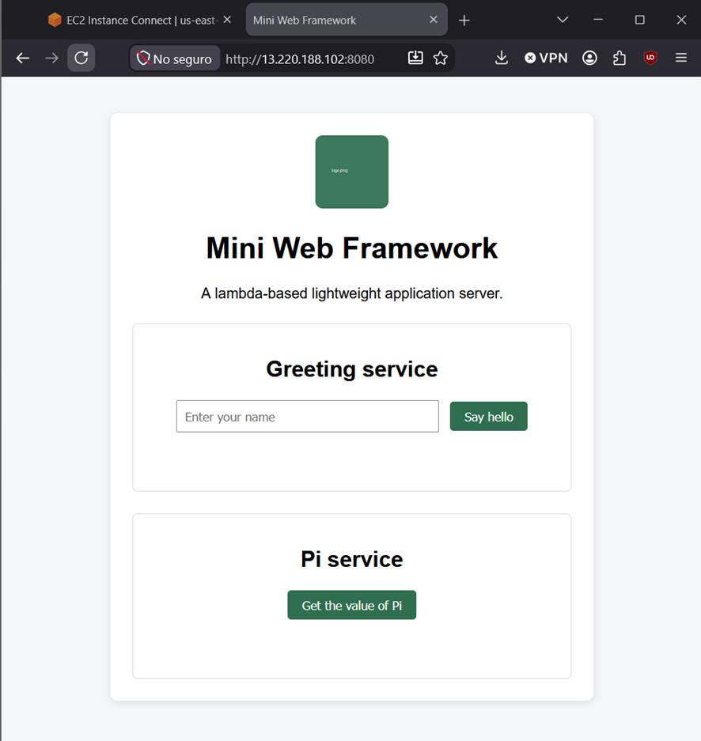 
- — the home
  page loading from the public EC2 address.

- **REST endpoint evidence:**
    - `docs/evidence/cloud-hello-endpoint.png` — `/hello?name=...` response.
    - `docs/evidence/cloud-pi-endpoint.png` — `/pi` response.
  
- **Environment variables evidence:** 

- 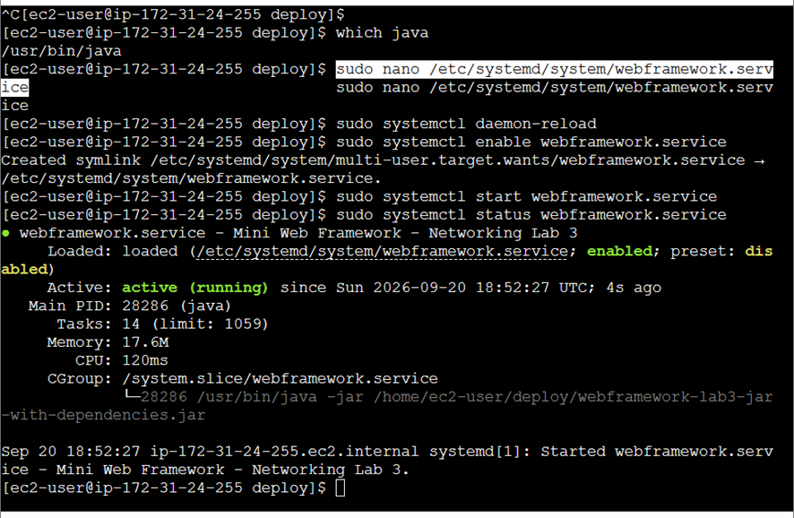
- 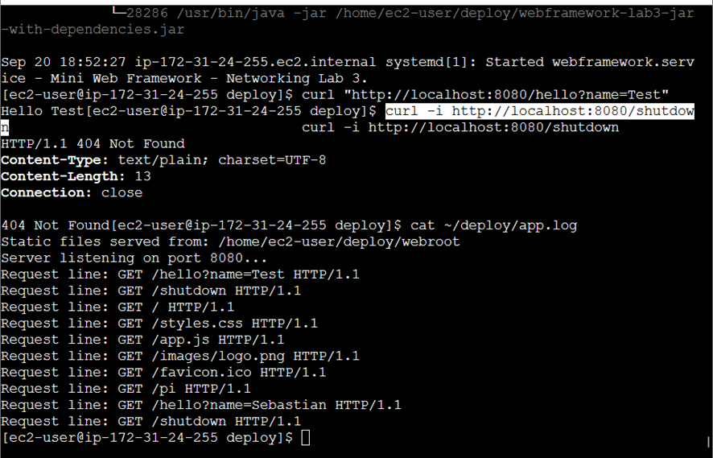
  configured variables (no secrets are used, so no redaction was needed).

- **`/shutdown` working in development (local):**

- 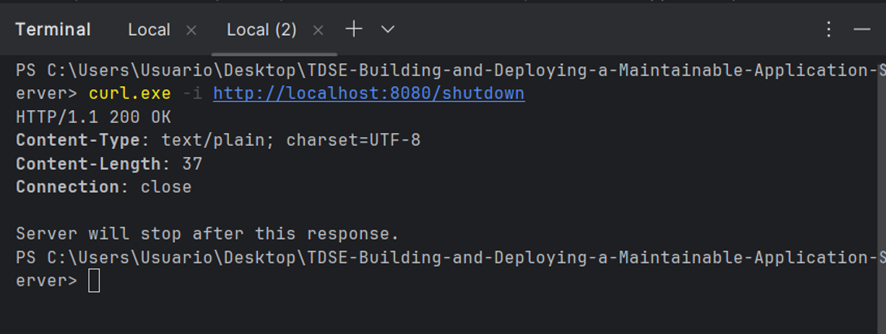
- 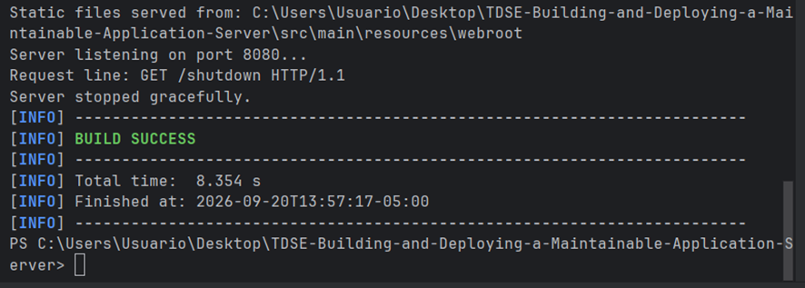
- 

- **`/shutdown` NOT available in production (cloud):**
  `docs/evidence/shutdown-prod-404.png` — a `404` response from
  `http://13.220.188.102:8080/shutdown`.


---

## 9. Tests performed

| # | Test | Command / action | Result |
|---|---|---|---|
| 1 | Valid greeting | `curl "http://localhost:8080/hello?name=Ana"` | `200`, `Hello Ana` |
| 2 | Greeting with missing param | `curl http://localhost:8080/hello` | `200`, `Hello world` (default applied) |
| 3 | Pi service | `curl http://localhost:8080/pi` | `200`, `3.14159...` |
| 4 | Static HTML | `curl -i http://localhost:8080/index.html` | `200`, `Content-Type: text/html` |
| 5 | Static image | `curl -i http://localhost:8080/images/logo.png` | `200`, `Content-Type: image/png` |
| 6 | Unknown resource | `curl -i http://localhost:8080/unknown` | `404 Not Found` |
| 7 | Unsupported method | `curl -i -X POST http://localhost:8080/hello` | `405 Method Not Allowed` |
| 8 | `GREETING_PREFIX` override | Run with `GREETING_PREFIX=Hola`, repeat test 1 | `Hola Ana` |
| 9 | `/shutdown` in development | `curl -i http://localhost:8080/shutdown` (default `APP_ENV`) | `200`, server exits gracefully |
| 10 | `/shutdown` in production | `curl -i http://13.220.188.102:8080/shutdown` | `404 Not Found` |
| 11 | Persistence after SSH close | Close all EC2 Instance Connect sessions, then request `/pi` from the public IP | Server keeps responding (managed by `systemd`) |

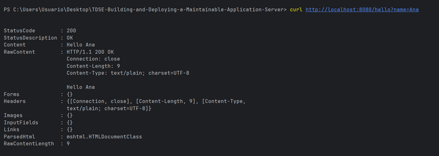

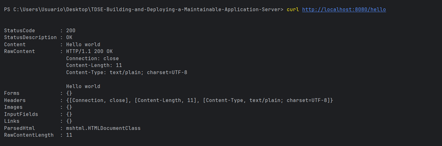

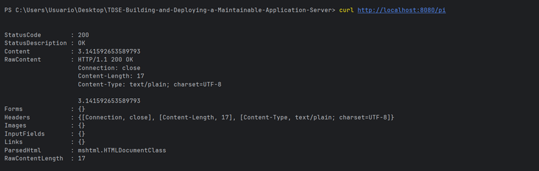

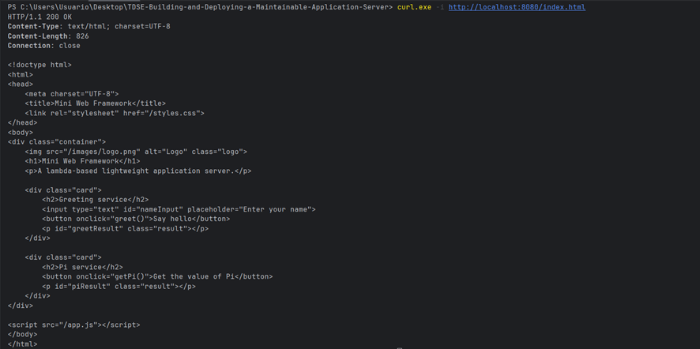

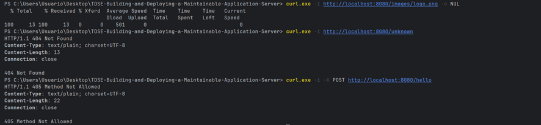

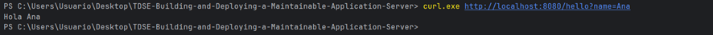

---

## 10. Why this architecture is maintainable

| Principle | Application in this project |
|---|---|
| Separation of concerns | HTTP infrastructure (`HttpServer`) is fully separate from application behavior (lambdas in `Application`). |
| Modularity | Routing, request/response abstractions, and static-file serving are independent classes. |
| Low coupling | Adding a new route (`get("/newRoute", ...)`) never requires touching `HttpServer`'s connection loop. |
| High cohesion | Each class has exactly one responsibility (e.g. `Router` only resolves paths; `StaticFileService` only serves files). |
| Abstraction | Application code uses `get()` and `staticfiles()` without ever touching a `Socket` or `ServerSocket`. |
| Externalized configuration | `PORT`, `APP_ENV`, `GREETING_PREFIX`, and `STATIC_FILES_PATH` live outside the source code, as environment variables. |
| Extensibility | New services are added by registering additional lambdas, with no structural changes elsewhere. |
| Operational maintainability | The exact same JAR runs unmodified both locally (development) and on EC2 (production), differing only by environment variables. |

---

## 11. Known limitations

- The server is strictly **sequential**: one TCP connection is processed at
  a time; no concurrency mechanism was added.
- Only the **GET** method is supported.
- The framework offers a minimal API surface (`get`, `staticfiles`, `start`,
  `stop`) — no POST/PUT/DELETE, no middleware, no path parameters beyond
  query strings.
- No authentication, HTTPS, or production-grade hardening is implemented;
  this is a teaching artifact.
- The AWS deployment runs on a single EC2 instance with no redundancy or
  load balancing.

---

## 12. Author and acknowledgment

**Author:** Sebastián Barros